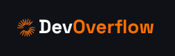

<div align="center">
  <br />
  
  <br />
  <p>A full-stack developer Q&A platform built with Next.js, MongoDB, OpenAI, and modern UI libraries.</p>
</div>

---

## 🧠 What is DevOverflow?

**DevOverflow** is a full-stack, production-ready Q&A web application built for developers. Inspired by Stack Overflow, it allows users to post technical questions, give and vote on answers, use AI to assist with queries, explore tags, and manage their developer profile.

---

## 🚀 Live Demo

> [🔗 Visit Live Site](https://dev-flow-flame.vercel.app)  
> _(Hosted on Vercel, optimized for performance)_

---

## 🔧 Tech Stack

- ⚙️ **Next.js 15 (App Router)**
- 💬 **NextAuth.js** (GitHub, Google, Credentials login)
- 🎨 **Tailwind CSS** + **ShadCN UI**
- 💾 **MongoDB** + Mongoose
- 🧠 **OpenAI API** (AI answers)
- 📄 **Zod** + **React Hook Form** (Validation)
- 🌐 **TypeScript**
- ✨ **Responsive design** with full accessibility

---

## 🧩 Features

- 🔐 **Authentication** (Email/Password, GitHub, Google)
- 💬 **Ask & answer** programming questions
- 🔎 **Global search** across questions, tags, and users
- 🤖 **AI-powered answers** via OpenAI API
- 👍 **Upvote/downvote** questions & answers
- 📌 **Save questions** to personal collections
- 🏷️ **Tag-based filtering** & tag detail pages
- 📊 **User profile with stats, badges & contributions**
- 🧑‍🤝‍🧑 **Community tab** to discover other users
- 🛠️ **Rich text editor** (TinyMCE + MDX) for writing answers
- 💼 **Jobs board** with filtering (by location, tags, etc.)
- ✍️ **Ask/Edit/Delete** questions or answers with auth
- 📱 **Fully responsive** (desktop, tablet, mobile)
- ⚡ **Optimized with caching, revalidation, pagination**

---

## 📂 Folder Structure

```

/app              - Next.js App Router structure
/components       - Reusable UI components
/constants        - Static values (routes, empty states)
/database         - Mongoose models
/lib              - API utilities, auth config, db connection
/public           - Static assets (icons, logos)

```

---

## ⚙️ Local Setup

**Clone and Install**

```bash
git clone https://github.com/Rishi-0007/DevFlow.git
cd DevFlow
npm install
```

**Configure Environment**

Create a `.env` file in the root:

```env
MONGODB_URI=
OPENAI_API_KEY=
AUTH_GOOGLE_ID=
AUTH_GOOGLE_SECRET=
AUTH_GITHUB_ID=
AUTH_GITHUB_SECRET=
AUTH_SECRET=
NEXTAUTH_URL=http://localhost:3000
NEXT_PUBLIC_TINY_EDITOR_API_KEY=
NEXT_PUBLIC_SERVER_URL=http://localhost:3000
```

**Run Development Server**

```bash
npm run dev
```

Open [http://localhost:3000](http://localhost:3000)

---

## 💼 Why this Project?

I built DevOverflow to:

- Practice **end-to-end app development** using the latest Next.js features
- Demonstrate **production-grade code** with authentication, error handling, and clean architecture
- Show capability in **full-stack development** using React, MongoDB, and OpenAI
- Highlight skills in **API design, validation, server actions**, and **dynamic routing**
- Create something **real and usable** — not just a portfolio piece

If you're hiring for a frontend, full-stack, or junior backend role — this project reflects the exact responsibilities those roles entail.

---

## 📬 Contact Me

- GitHub: [@Rishi-0007](https://github.com/Rishi-0007)
- LinkedIn: [Rishi Nayak](https://www.linkedin.com/in/rishi-nayak-51b1a821a/)
- Email: [rishikumarnayak9@gmail.com](mailto:rishikumarnayak9@gmail.com)

---

_This is a personal project created for learning, showcasing skills, and exploring full-stack best practices._
